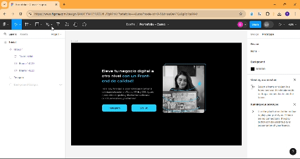
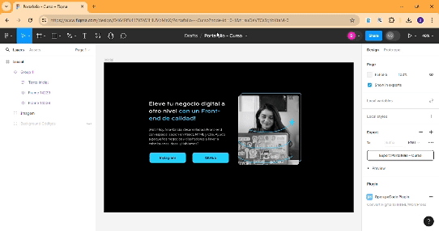
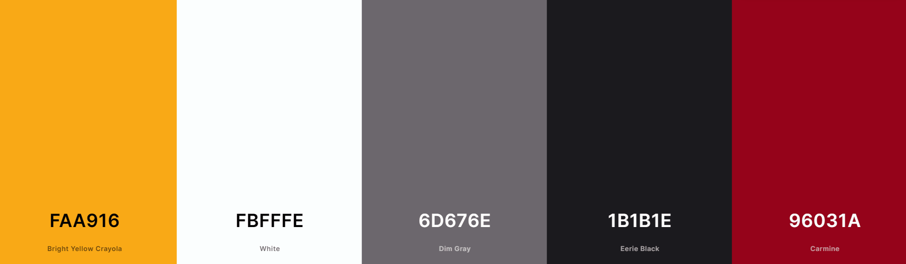
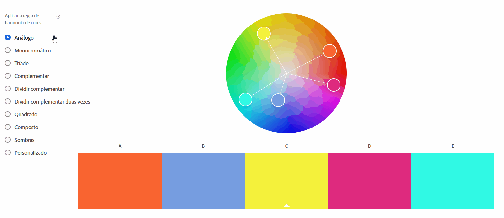
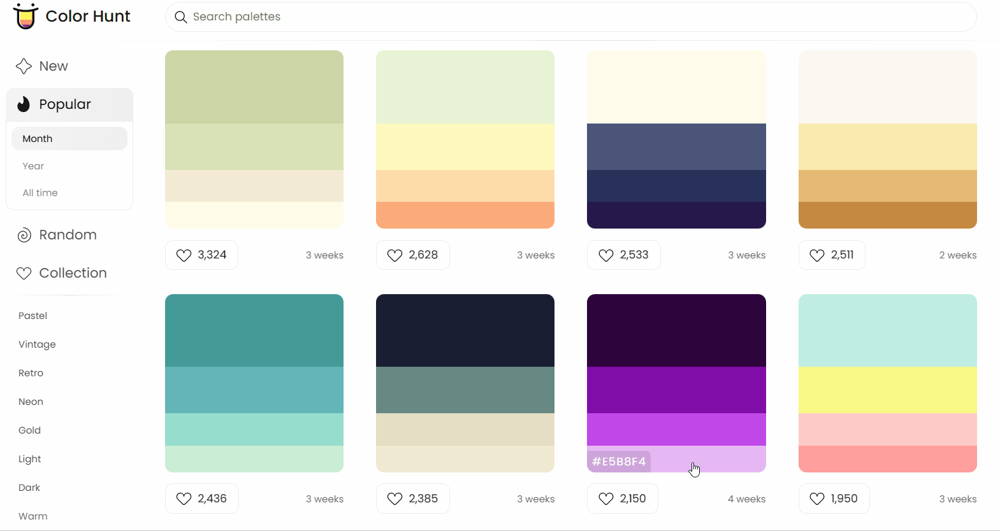
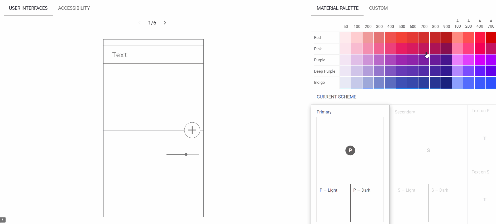
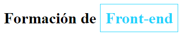

    Diferenciar la creación de un archivo en Google Docs y en HTML;
    Descargar e instalar Visual Studio Code;
    Crear una carpeta y abrirla en el editor de código.

### direccion de documentacion
https://w3schools.com/html/html_intro.asp

### Para saber más: la importancia de la documentación
¿Qué es?

La documentación es una guía que todo desarrollador debe tomar en serio en su día a día. A través de ella, aprendemos cómo funcionan los lenguajes de programación, así como las herramientas y bibliotecas en el mundo de la tecnología.

Su importancia:

La documentación es crucial para el aprendizaje y el desarrollo de aplicaciones. Después de todo, ¿quién mejor que la persona que creó la herramienta para orientarnos sobre sus funcionalidades, verdad?

Cuándo debemos utilizarla:

Debemos leer la documentación siempre que necesitemos conocer la estructura de un método o cuando queremos saber algún comando o recurso de una biblioteca, e incluso cuando olvidamos cierta funcionalidad y necesitamos recordarla.

Otra forma de ayuda:

También existen las comunidades de tecnología y programación, que son muy útiles para resolver nuestras dudas y aprender más, como por ejemplo Stack Overflow, que es una de las mayores comunidades de ayuda sobre programación y tecnología en la actualidad. Es una comunidad donde encontrarás preguntas sobre casi todos los lenguajes de programación, entre otras herramientas; es muy recomendable acceder a ella.

### Haga lo que hicimos en aula

1 - Construyendo la estructura básica de HTML

Acabas de comenzar una pasantía en una empresa de desarrollo web y tu primera tarea es crear un documento HTML básico para un nuevo proyecto. El objetivo es construir la estructura fundamental de un archivo HTML, incluyendo las etiquetas esenciales: <!DOCTYPE html>, <html>, <head> y <body>. Además, dentro de la etiqueta <head>, agrega una etiqueta <title> con un título de tu elección para la página. Recuerda seguir las prácticas de indentación correctas para mantener el código organizado.

2 - Añadiendo contenido a HTML

Ahora que la estructura básica de tu documento HTML está lista, tu supervisor te pidió que agregues un encabezado y un párrafo al cuerpo del documento. Utiliza las etiquetas <h1> para el encabezado y 
 para el párrafo. Elige un tema para el encabezado y escribe un breve párrafo relacionado con ese tema.

3 - Trabajando con metaetiquetas y título

Necesitas optimizar la sección <head> de la página HTML existente. Agrega una metaetiqueta para establecer la codificación de caracteres como UTF-8 y cambia el título de la página a algo más descriptivo y apropiado para el contenido del sitio.

4 - Organizando contenido con etiquetas HTML

Estás desarrollando la página de inicio de un sitio para un proyecto personal. Necesitas crear un título principal y un subtítulo, seguidos por un breve párrafo explicativo. Utiliza HTML para estructurar estos elementos. Crea un archivo HTML y agrega un título principal con la etiqueta <h1>, un subtítulo con la etiqueta <h2> y un párrafo con la etiqueta 
. Usa textos de tu elección para cada uno de estos. Recuerda seguir la jerarquía correcta de las etiquetas y verifica el resultado en el navegador.

5 - Añadiendo imágenes con accesibilidad

En este desafío, agregarás una imagen a tu proyecto de sitio personal. Elige una imagen de tu preferencia (puede ser un logotipo o una foto relacionada con el tema del sitio). Utiliza la etiqueta  para insertar la imagen en el cuerpo del documento HTML y no olvides incluir el atributo alt para describir la imagen, mejorando la accesibilidad del sitio. Verifica el resultado en el navegador.

6 - Listando elementos en HTML

Ahora, agrega una lista de elementos a tu sitio. Esta lista puede ser de características del proyecto, etapas de desarrollo o cualquier otra información relevante. Utiliza la etiqueta <ul> para una lista no ordenada o <ol> para una lista ordenada, y <li> para cada elemento de la lista. Verifica el diseño en el navegador después de la inserción.

7 - Explorando el impacto del DOCTYPE en HTML

Tu tarea es explorar el impacto de la declaración <!DOCTYPE html> en un documento HTML. Crea un archivo HTML básico con la estructura presentada en el informe, incluyendo elementos como <head>, <title>, <body>, <h1>, 
 e . Primero, visualiza la página con la declaración <!DOCTYPE html>. Luego, elimina la declaración y visualiza nuevamente. Utiliza la herramienta de inspección del navegador para explorar las diferencias en el modo de renderización de la página, centrándote en la presencia o ausencia del "Modo Quirks".

8 - Automatizando la actualización de la página con Live Server

Instala y utiliza la extensión "Live Server" en Visual Studio Code para automatizar la actualización de tu página HTML. Realiza cambios en el código HTML, como agregar texto al párrafo, y observa cómo los cambios se reflejan automáticamente en el navegador.

    La importancia de la documentación de W3S;
    Qué es HTML y por qué se considera un lenguaje de marcado;
    Cómo estructurar un documento HTML con etiquetas y elementos;
    La utilidad de la introducción <!DOCTYPE html>;
    La diferencia entre la metainformación presente en <head> y el contenido presente en <body> de una página HTML;
    Cómo crear textos alternativos (alts) para una imagen;
    Cómo acceder a las Developer Tools (Herramientas para Desarrolladores) de un navegador;
    Qué es el Quirks mode (modo peculiaridad);
    Cómo utilizar extensiones en Visual Studio Code (como Live Server, por ejemplo).

### Preparando el ambiente

Las próximas clases se basarán en Figma, que es una herramienta de prototipado de interfaces, donde construiremos el diseño de la página del Portafolio. Para acceder, haz clic aquí.

Para tener la misma visualización que en la clase, primero necesitas crear una cuenta o iniciar sesión en una existente. Para hacerlo, ve al sitio de Figma y haz clic en Iniciar sesión (si ya tienes una cuenta) o en Registrarse (para crear una nueva cuenta). Después de tener una cuenta conectada, accede al proyecto en Figma.

Atención: Ten en cuenta que las pestañas Diseño e Inspeccionar mostradas en el curso han experimentado actualizaciones recientes en Figma y ahora son opciones premium, es decir, de pago. Pero no te preocupes, ¡en el Figma proporcionado puedes obtener la información de los elementos a través de la pestaña Propiedades! Solo tienes que hacer clic en los componentes y verificar sus propiedades en la pestaña Design, como se muestra a continuación:

Ingrese aquí la descripción de esta imagen para ayudar con la accesibilidad

Si deseas crear una copia del diseño en tu cuenta de Figma para asegurar el acceso de edición, ve al enlace del diseño original mencionado arriba y en el menú superior de la plataforma, haz clic en el nombre del archivo: Portafolio - Curso. Se abrirán algunas opciones, haz clic en "Duplicar en tus borradores" y el archivo del proyecto se duplicará para tu uso personal.

Ingrese aquí la descripción de esta imagen para ayudar con la accesibilidad

Activando WebGL

Si aparece el mensaje: "no podemos abrir ese archivo. No podemos abrir este archivo porque WebGL no es compatible o está desactivado en tu navegador. Si tu navegador admite WebGL, consulta este artículo de ayuda para saber cómo activarlo", significa que WebGL está desactivado en tu navegador y necesitas activarlo.

En Google Chrome, escribe lo siguiente en la barra de búsqueda: chrome://flags/. Luego, busca "WebGL" en la lista y actívalo, cambiando de Desactivado a Activado. Después de eso, aparecerá un botón para reiniciar Google Chrome. Reinicia el navegador y listo.

Si tu navegador no es Google Chrome, el procedimiento es similar. WebGL está desactivado y necesita ser activado.

Pagina de Figma: http://figma.com

#### Para saber más: aumenta tu productividad en el VSCode con Emmet

Imagina que eres un desarrollador de software trabajando en un proyecto web en Visual Studio Code (VSCode). Estás inmerso en un entorno ágil donde la productividad y la eficiencia son fundamentales. El proyecto requiere la creación de código HTML y CSS para varias páginas y elementos. Sin embargo, escribir todo ese código repetitivo puede resultar tedioso y consumir mucho tiempo.

El problema

La problemática radica en la necesidad de acelerar el proceso de escritura de código HTML y CSS en VSCode. Los desarrolladores a menudo se encuentran con tareas repetitivas, como crear varias etiquetas, clases e IDs, lo que puede llevar a errores y disminuir la velocidad de desarrollo. Además, los nuevos miembros del equipo pueden tardar en familiarizarse con el código existente si la estructura no está optimizada.

La solución

Para resolver este problema, podemos contar con la ayuda de Emmet, una extensión potente y ampliamente utilizada en VSCode. Emmet: https://docs.emmet.io/ es una herramienta que permite escribir códigos HTML y CSS de manera extremadamente rápida y productiva. Utiliza abreviaciones para generar estructuras complejas de código con solo algunos comandos, mejorando significativamente la eficiencia del desarrollador.

¿Qué es Emmet?

Emmet, anteriormente conocido como Zen Coding, es una herramienta avanzada de codificación desarrollada por Sergey Chikuyonok. Está diseñado para facilitar la escritura rápida y simplificada de código HTML y CSS. Emmet ofrece una forma inteligente de crear estructuras complejas mediante abreviaturas fáciles de recordar.

Emmet utiliza la sintaxis similar a CSS para crear código HTML y CSS. Con solo unas pocas teclas, puedes generar bloques completos de código rápidamente. Por ejemplo, al escribir ul>li*3, Emmet creará automáticamente una lista no ordenada (ul) con tres elementos de lista (li).

Instalación de Emmet en VSCode

Si aún no tienes Emmet instalado en tu VSCode, sigue estos pasos:

    Abre Visual Studio Code.
    Haz clic en la pestaña de extensiones en el menú lateral izquierdo o usa el atajo Ctrl+Shift+X (Windows/Linux) o Cmd+Shift+X (macOS).
    En la barra de búsqueda, escribe "Emmet" y presiona Enter.
    Localiza la extensión "Emmet" en la lista de resultados y haz clic en "Instalar".
    Después de la instalación, verás la opción "Emmet" activada y lista para usar en VSCode.

Cómo usar Emmet

Con Emmet instalado, puedes comenzar a utilizar sus abreviaturas para acelerar el desarrollo. Algunas abreviaturas comunes incluyen:

    html: Genera la estructura básica de un documento HTML.
    ul>li*5: Crea una lista no ordenada con cinco elementos de lista.
    div>h1+p: Crea una div que contiene un encabezado (h1) seguido de un párrafo (p).
    input[type=text]+input[type=password]: Crea dos campos de entrada, uno para texto y otro para contraseña.

Estas son solo algunas de las muchas abreviaturas que Emmet ofrece. A medida que te familiarices con ellas, tu productividad aumentará significativamente.

Conclusión

Emmet es una extensión imprescindible para cualquier desarrollador que desee optimizar su productividad en Visual Studio Code. Con sus abreviaturas intuitivas, permite la creación rápida y eficiente de código HTML y CSS, ahorrando tiempo y evitando errores comunes.

### Para saber más: la estructura básica del HTML
Para crear un archivo HTML funcional, debemos seguir un patrón de construcción utilizando un conjunto de elementos, es decir, hipertextos que se conectan entre sí formando la página. Como se vio anteriormente, los elementos HTML, también llamados etiquetas HTML, se utilizan para informar al navegador sobre el tipo de estructura que se está construyendo, ya sea títulos, párrafos, imágenes, enlaces, entre otros. Un ejemplo práctico de esta estructura básica sería:

<!DOCTYPE html>
<html lang="es-MX">
<head>
    <meta charset="UTF-8">
    <meta name="viewport" content="width=device-width, initial-scale=1.0">
    <title>Document</title>
</head>
<body>

</body>
</html>

Etiquetas semánticas

Cuando comenzamos un archivo HTML, es importante saber qué etiquetas deben implementarse y comprender sus funciones dentro del código. Para facilitar este proceso, utilizamos etiquetas semánticas, que son descriptivas sobre el contenido que almacenan, como es el caso de las etiquetas <header>, <main> y <footer>, que conocimos en esta lección. Sirven tanto para optimizar la lectura por parte de los navegadores como para las personas desarrolladoras que realizarán el mantenimiento del código.

Para aprender más sobre las etiquetas que forman parte de la base de un archivo HTML, puedes leer la documentación de MDN "Semántica". También recomendamos el artículo "¿Qué es HTML y sus tags? Estructura básica", que es el primero de una serie de cinco artículos sobre qué es HTML y sus etiquetas. Puedes encontrarlos aquí en la plataforma de Alura Latam y son perfectos para desarrolladores HTML principiantes.

### Hagamos lo que hicmos en aula
1) Construyendo la estructura HTML del portafolio

Acabas de recibir un diseño de página de portafolio de tu diseñadora. El desafío es transformar ese diseño en una página web funcional. Utilizando HTML, crea la estructura básica de la página. Recuerda incluir los elementos principales: un título principal, un subtítulo, dos botones (Instagram y Github), y un espacio para la imagen de la desarrolladora. Siéntete libre de personalizar el texto y la imagen para adaptarlos a tu portafolio personal.

2) Estructurando la página con etiquetas semánticas

Ahora que entiendes la importancia de las etiquetas semánticas en HTML, es hora de aplicar ese conocimiento. Utiliza las etiquetas header, main y footer para estructurar tu página de portafolio. En el header, inserta un menú o un logotipo. En el main, agrega los elementos del portafolio como título, párrafo, botones e imagen. Por último, en el footer, coloca información como contacto o derechos de autor. Recuerda que cada elemento debe colocarse de manera lógica y estructurada para crear un sitio accesible y bien organizado.

3) Entendiendo y aplicando las etiquetas meta

Explora el uso de las etiquetas meta en el encabezado de tu HTML. Cambia la etiqueta lang a "es", ajusta el charset a "UTF-8", agrega la etiqueta meta para la compatibilidad con Edge y otra para la configuración del viewport. Finalmente, cambia el título de tu página a algo relacionado con tu proyecto, por ejemplo, "Portafolio de [Tu Nombre]". Entiende cómo cada uno de estos cambios afecta la funcionalidad y accesibilidad de tu sitio.

4) Insertando y formateando elementos en HTML

Ahora que ya tienes una base sólida sobre la estructura HTML, vamos a agregar y formatear elementos en tu página de portafolio. Sigue el diseño de Figma y comienza agregando un título (<h1>) con un resalte (<strong>) en una parte de él. Luego, inserta un párrafo (
) con una breve introducción sobre ti o tu empresa. Finalmente, agrega enlaces (<a>) a tus redes sociales o portafolios en línea, como Instagram y GitHub. Asegúrate de que cada elemento esté correctamente formateado y colocado según el diseño de Figma.

5) Incorporando imágenes con etiquetas HTML

¡Ha llegado el momento de dar un toque visual a tu página! Elige una imagen que te represente a ti o tu trabajo y agrégala a tu página de portafolio utilizando la etiqueta . Recuerda incluir la propiedad src con la ruta de la imagen y alt con una descripción adecuada de la imagen. Esto no solo mejora la accesibilidad de tu sitio, sino que también ayuda a los motores de búsqueda a entender el contenido de la imagen.

    Cómo consultar el diseño del proyecto en Figma;
    Escribir el código base del archivo HTML, utilizando las etiquetas semánticas que forman parte de la estructura básica del archivo;
    La función de cada etiqueta meta.

### Haga lo que hicimos en aula
1 - Estiliza tú HTML

En esta lección, aprendimos que con CSS podemos seleccionar elementos de HTML y asignar propiedades de CSS dentro de llaves para estilizar estos elementos.

Lo hicimos asignando un color de fondo negro a la etiqueta <body> a través de la propiedad background-color y cambiamos el color del texto a blanco utilizando la propiedad color, de la siguiente manera:

body{
    background-color: black;
    color: white;
}

Ahora que ya sabes cómo crear una hoja de estilo para tu página HTML, es el momento de aplicar lo que aprendiste en esta lección. Modifica el estilo de la etiqueta <body>, prueba nuevos colores para el fondo y el texto, ¡y personaliza el proyecto a tu gusto! =)

No olvides aplicar la etiqueta <link rel="stylesheet" href="style.css"> dentro de la etiqueta <head> en tu archivo HTML para que tu estilo funcione correctamente.

2 - Practicando cómo utilizar el CSS

1) Creando y vinculando el archivo CSS

Vas a crear un archivo CSS llamado style.css para estilizar una página web. Después de crear el archivo, tu objetivo es vincular este archivo CSS al HTML. Para lograrlo, usarás la etiqueta <link> dentro de la etiqueta <head> del documento HTML, especificando la ruta del archivo CSS. Este proceso es crucial para que los estilos definidos en CSS se apliquen a la página HTML.

2) Definiendo estilos básicos

En el archivo CSS, define el color de fondo del cuerpo de la página (<body>) como índigo (indigo) y el color del texto como blanco (white). Guarda los cambios y verifica en el navegador si el fondo de la página es índigo y el texto es blanco.

3) Estilizando con colores y formatos

Te han desafiado a dar vida a una página web que actualmente solo tiene HTML. Tu tarea es utilizar CSS para agregar colores y formatos a los elementos de la página, inspirándote en un diseño específico proporcionado en Figma. Concéntrate en seleccionar colores adecuados para fondos, textos y bordes, además de aplicar estilos a botones y encabezados para hacerlos visualmente atractivos. Puedes usar como referencia esta tabla de nombres de colores.

4) Personalizando la página con CSS

Imagina que estás trabajando en un proyecto web y ha llegado el momento de darle vida a tu página con colores, formas y estilos. Tu tarea es crear un archivo CSS para estilizar una página HTML simple, que contiene un encabezado, un párrafo y un pie de página. Utiliza tu conocimiento para definir los colores del texto y del fondo.

5) Aplicando estilos con CSS

Ahora, vayamos un poco más allá. Necesitas crear tres archivos CSS diferentes, cada uno con un estilo único, para el mismo archivo HTML. Esto demostrará cómo el CSS puede cambiar drásticamente la apariencia de una página sin alterar el HTML. Crea estilos variados para los elementos de la página: un archivo con un estilo formal y elegante, otro con un estilo colorido y divertido, y un tercero con un aspecto minimalista y limpio.

6) Personalizando enlaces

La última tarea es estilizar los enlaces en la página. Deberás modificar la apariencia de los enlaces para que se destaquen del fondo y del texto. Utiliza propiedades CSS, como color, para personalizarlos, siguiendo las directrices del diseño proporcionado en Figma.

    Qué es CSS (Hojas de Estilo en Cascada);
    Estilización en la práctica;
    Propiedades de CSS;
    Crear un archivo externo para estilizar la página;
    Integrar el archivo CSS al archivo HTML.

### Para saber más: eligiendo los colores del proyecto

Llegó el momento de poner manos a la obra. Te desafiamos a elegir colores para tu proyecto, ya que una paleta es esencial para proporcionar una buena experiencia de usuario y enriquecer la identidad de tu página. Y para ayudarte con este desafío, hemos seleccionado algunos sitios.

Coolors

Coolors tiene una interfaz muy clara. Con la barra espaciadora de tu teclado, puedes crear varias combinaciones, y una de las funciones más geniales es la opción de bloqueo, que puedes usar si te gusta solo un color. Una vez que haces clic en él, puedes seguir elaborando otras combinaciones teniendo en cuenta el color que elegiste.

Adobe Color

Adobe Color presenta una Rueda de Colores que se puede ajustar de diversas maneras para obtener una armonía de colores. Puedes aplicar varias reglas de armonía de colores, como el modo análogo, monocromático, tríada, complementario, cuadrado, compuesto, entre otros.

Color Hunt

Color Hunt ofrece diversas paletas elaboradas. Puedes encontrar la combinación que más te guste y buscar por palabras clave como pastel, vintage, neón, y así sucesivamente. Y si no encuentras ninguna que te guste, puedes crear tu propia paleta haciendo clic en los tres puntos en la esquina superior derecha de la página.

Color Tool - Material Design

Color Tool es excelente para crear, compartir y aplicar paletas de colores a la interfaz de usuario. También puedes medir el nivel de accesibilidad de cualquier combinación de colores en la pestaña de accesibilidad.

¡Ahora depende de ti! Encuentra la paleta de colores que más te guste y aplícala en el proyecto para darle tu toque personal :D

###  Para saber más: resaltando el texto
Aprendiste a destacar el texto utilizando la etiqueta <strong>, sin embargo, hay otra etiqueta que también se utiliza mucho para esto, que es la etiqueta . A diferencia de <strong>,  no aplica negrita por defecto, pero es una excelente forma de resaltar partes del texto en HTML. Mira:

HTML
<h1>Formación de Front-end</h1>

CSS

h1{
            font-weight: bold;
}

span{
            color: #22D4FD;
            border: 1px solid #22D4FD;
            padding: 10px;
}

Explicando el código anterior:

font-weight: bold; (Texto en negrita)

color: #22D4FD; (Color del texto azul)

border: 1px solid #22D4FD; (Borde con 1 px de ancho, de tipo sólido y color del borde azul)

padding: 10px; (Espaciado interno de 10px)

RESULTADO:

### Desafío: comparta tú proyecto con el mundo
Ahora que has conocido HTML y CSS y has creado la base de tu portafolio, ¿qué tal personalizar este proyecto y darle tu toque personal?

Puedes personalizar el título y agregar información sobre ti en el párrafo de texto, poner tu foto y los enlaces a tus redes sociales, además de modificar el CSS trabajando con colores y resaltados. ¡Desata tu creatividad!

Además, ¡nos encantaría ver tu progreso en este curso! Así que siéntete libre de compartir tu proyecto con nosotros publicándolo en tus redes sociales como Instagram, Twitter y LinkedIn. Puedes hacerlo de la manera que prefieras, ya sea a través de fotos, historias, videos, etc. ¡Y no olvides etiquetar el perfil de Alura Latam, estaremos atentos a los proyectos!

### Haga lo que hicimos en aula

1) Armonía de colores en CSS

Imagina que estás trabajando en el desarrollo de un sitio web personal. Utiliza la Rueda de Colores de Adobe para crear una paleta de colores armoniosa. Elige un color principal y dos colores secundarios para tu sitio. Luego, aplica estos colores en el archivo style.css de tu proyecto, usando el color principal para el background-color y los colores secundarios para el color de dos tipos diferentes de texto (por ejemplo, títulos y párrafos).

2) Identificación y corrección de errores de colores en CSS

Te han asignado corregir un error en un proyecto web donde el texto no es visible debido a un problema de color. El cuerpo de la página tiene background-color: #000000; y el color del texto se ha definido como negro, haciéndolo invisible. Tu tarea es corregir este error cambiando el valor de color a un color visible, como #F6F6F6 u otro color claro, asegurando la legibilidad del texto.

3) Jugando con colores RGB en CSS

Vamos a experimentar con la representación de colores en RGB en CSS. Elige dos colores que te gusten, uno para el fondo (background-color) y otro para el texto (color). Utiliza la notación hexadecimal RGB para definir estos colores en el archivo style.css. Por ejemplo, puedes usar #FF5733 para un color naranja vibrante y #00FF00 para un verde brillante. Aplica estos colores en el cuerpo de tu página y observa cómo interactúan.

### Para saber más: profundizando en HTML y CSS

Aquí tienes una lista de referencias para que profundices en tus estudios, mejores tus conocimientos y adquieras nuevas habilidades.

1- HTML, CSS y JavaScript - Las diferencias - (Gratuito, Español, Texto) https://www.aluracursos.com/blog/html-css-javascript-cuales-son-las-diferencias

Este artículo ofrece una visión general de las tres principales lenguajes utilizadas en el desarrollo front-end de la programación web. El HTML, como lenguaje de marcado, se utiliza para estructurar elementos en una página web, mientras que el CSS es un lenguaje de estilo que define la apariencia estética de los elementos HTML. Por otro lado, JavaScript es un lenguaje de programación que añade dinamismo e interactividad a las páginas web.

2 - Introducción a las etiquetas HTML - (Gratuito, Inglés, Tutorial) https://www.w3schools.com/tags/

Una guía detallada sobre las diversas etiquetas HTML disponibles. Cada etiqueta se explica con ejemplos prácticos, facilitando la comprensión de cómo usar las etiquetas para estructurar una página web.

3 - Tutorial de HTML Básico - MDN Web Docs (Gratuito, Español, Online) https://developer.mozilla.org/es/docs/Learn/Getting_started_with_the_web/HTML_basics

MDN Web Docs presenta una guía para principiantes sobre HTML, cubriendo los conceptos fundamentales y la estructura de un documento HTML. Este tutorial es detallado y está disponible en portugués, siendo una excelente referencia para quienes están empezando.

4 - Estructura básica de una página HTML - HTML Dog (Gratuito, Inglés, Online) https://htmldog.com/guides/html/beginner/

HTML Dog ofrece una guía simple y clara sobre la estructura básica de una página HTML, explicando la importancia de cada sección, incluyendo <body>, <head>, <h1>, 
 y .

5 - Tutorial de accesibilidad en la web - WebAIM (Gratuito, Inglés, Online) https://webaim.org/intro/

WebAIM proporciona un tutorial introductorio sobre accesibilidad en la web, esencial para entender cómo hacer que el contenido sea accesible para todos los usuarios, incluyendo aquellos que utilizan lectores de pantalla.

6 - Modo Quirks y estándares en navegadores - MDN Web Docs (Gratuito, Español, Online) https://developer.mozilla.org/es/docs/Web/HTML/Quirks_Mode_and_Standards_Mode

MDN Web Docs ofrece una visión detallada sobre el Modo Quirks y el Modo Estándar, explicando cómo los navegadores interpretan el código HTML basándose en la presencia o ausencia del DOCTYPE.

7 - Uso de extensiones en Visual Studio Code - Visual Studio Code Docs (Gratuito, Inglés, Online) https://code.visualstudio.com/docs/editor/extension-marketplace

Documentación oficial de Visual Studio Code sobre cómo utilizar extensiones, incluyendo la instalación y configuración de Live Server, que permite la actualización automática de la página HTML durante el desarrollo.

8 - Extensión Live Server para Visual Studio Code - GitHub (Gratuito, Inglés, Online) https://github.com/ritwickdey/vscode-live-server

Página oficial de la extensión Live Server en GitHub, proporcionando detalles sobre sus funciones, instalación y uso, esencial para un desarrollo más eficiente de páginas web.

9 - UX/UI Design: Fundamentos para la calidad en la interfaz de usuario - Interaction Design Foundation (Gratuito/Pago, Inglés, Online) https://www.interaction-design.org/literature/topics/ux-design

Interaction Design Foundation ofrece recursos educativos completos sobre UX/UI Design, fundamentales para entender la importancia del diseño en la experiencia del usuario.

10 - Consejos de CSS (Gratuito, Inglés, Online) https://css-tricks.com/guides/

CSS Tricks presenta tutoriales completos y consejos sobre CSS, esenciales para dar estilo a páginas web según las especificaciones de diseño.

11 - Guía de estructuración de páginas HTML con semántica - MDN Web Docs (Gratuito, Español, Online) https://developer.mozilla.org/es/docs/Web/HTML/Element

Una guía completa sobre la estructuración de páginas HTML, haciendo hincapié en el uso de etiquetas semánticas como <header>, <main> y <footer>, esencial para crear páginas bien organizadas y accesibles.

12 - Utilizando Emmet para acelerar el desarrollo HTML - CSS-Tricks (Gratuito, Inglés, Online) https://css-tricks.com/emmet/

Un artículo detallado sobre cómo utilizar Emmet, una herramienta de productividad para el desarrollo web, para acelerar la escritura de códigos HTML, incluyendo la

13 - Introducción a HTML5 y etiquetas semánticas - HTML.com (Gratuito, Inglés, Online) https://html.com/html5/

Una guía completa sobre HTML5, destacando la importancia y el uso de etiquetas semánticas como <header>, <main>, <footer> y <strong>, esenciales para crear una estructura de página clara y accesible.

14 - Uso efectivo de las etiquetas de anclaje en HTML - W3Schools (Gratuito, Inglés, Online) https://www.w3schools.com/html/html_links.asp

Este recurso explica cómo utilizar las etiquetas de anclaje (<a>) en HTML, un componente fundamental para crear enlaces que redirigen a otras páginas o recursos.

15.Cómo insertar imágenes en HTML - MDN Web Docs (Gratuito, Español, Online) https://developer.mozilla.org/es/docs/Web/HTML/Element/img

Una guía detallada sobre la etiqueta en HTML, incluyendo cómo usar el atributo src para insertar imágenes y la importancia del atributo alt para la accesibilidad.

16.Prácticas recomendadas para el diseño responsivo - Smashing Magazine (Gratuito, Inglés, Online) https://www.smashingmagazine.com/2011/01/guidelines-for-responsive-web-design/

Este artículo aborda las mejores prácticas para el diseño responsivo en el desarrollo web, algo crucial para garantizar que un sitio funcione bien en todos los dispositivos y tamaños de pantalla.

17.Introducción a CSS - W3Schools (Gratuito, Inglés, Online) https://www.w3schools.com/css/

Un recurso introductorio a CSS, ofreciendo lecciones paso a paso sobre cómo usar CSS para mejorar la apariencia de las páginas HTML, abordando desde la formatación básica hasta conceptos más avanzados.

18.Cómo utilizar hojas de estilo en cascada (CSS) - MDN Web Docs (Gratuito, Inglés, Online) https://developer.mozilla.org/en-US/docs/Web/CSS

Este recurso de MDN Web Docs explica en detalle cómo usar CSS para estilizar elementos HTML, incluyendo cómo crear y vincular archivos CSS externos.

19. Guía de colores y fuentes en CSS - Adobe Color (Gratuito, Inglés, Online) https://color.adobe.com/es/create/color-wheel

Esta guía de Adobe ayuda a entender cómo combinar colores y elegir fuentes en CSS, alineando el diseño de la página web con las especificaciones del proyecto en Figma.

    Usar los colores en CSS;
    Utilizar colores hexadecimales en CSS;
    Utilizar paletas de colores de terceros;
    Cambiar los colores de fondo y de los textos;
    Extraer el color de Figma para usar en CSS;
    Destacar el texto y cambiar el color del texto destacado.