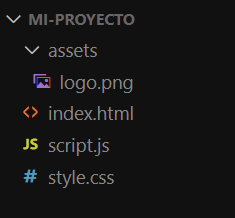

¿Cuál de las siguientes alternativas representa la solución para organizar estos elementos como deseas?

    Alternativa correta

    Podemos agregar la propiedad flex-direction: column al CSS de la clase .container.

Al agregar la propiedad flex-direction: column, los cuadrados se posicionan verticalmente, ya que define que la dirección del display: flex debe ser en "columna".
Alternativa correta

Podemos agregar la propiedad justify-content: center al CSS de la clase .container.
Alternativa correta

Podemos agregar la propiedad align-items: flex-start al CSS de la clase .container.
Alternativa correta

Podemos agregar la propiedad flex-direction: row al CSS de la clase .container.

Aprendemos que una práctica común en el desarrollo con HTML y CSS es crear una carpeta de assets para insertar todas las imágenes del proyecto. Sin embargo, al buscar alguna imagen a través de la etiqueta img en HTML, necesitamos prestar atención al camino de ese archivo que está dentro de las carpetas. Con eso en mente, observe la organización de las carpetas del proyecto a continuación:

Ingrese aquí la descripción de esta imagen para ayudar con la accesibilidad

Necesitas que el archivo logo.png, ubicado dentro de la carpeta de assets del proyecto, se muestre en el HTML y para eso creas el siguiente código:

Dado el código, señale la afirmación correcta sobre lo que ocurrirá con la imagen en la visualización de la página:

    Alternativa correta

    La imagen no se mostrará, ya que la ruta en src debería ser /..logo.png.

Alternativa correta

La imagen no se mostrará, ya que la ruta en src debería ser ../logo.png.
Alternativa correta

La imagen se romperá y solo se mostrará el texto alternativo, ya que el enlace de la imagen en src está incorrecto.

El HTML no encontrará la imagen, ya que el enlace en src debería considerar que la imagen está dentro de una carpeta. Por lo tanto, el enlace correcto debería ser ./assets/logo.png. Siempre debemos estar atentos a la organización de las carpetas cuando queremos buscar un archivo a través de su ruta.
Alternativa correta

La imagen se mostrará normalmente, ya que su ruta se agregó correctamente y no hubo errores de sintaxis al escribir el elemento src.

### Posicionando elementos con Flexbox

Creas un proyecto HTML con una imagen y un párrafo de texto, los cuales están dentro de una sección, como podemos observar en el código siguiente:

<section>
    
    
Estoy estudiando HTML y CSS en Alura Latam!

</section>  

Luego, creas un archivo CSS para esta página, donde estilizas algunos detalles según tu preferencia y agregas un display: flex para posicionar los elementos uno al lado del otro, de la siguiente manera:

section{
    border-style: solid;    /* Crea un borde sólido */
    border-color:red;   /* Colorea el borde con el color rojo*/
    margin: 10%;    /* Agrega un margen alrededor de la section */
    display: flex;  /* Agrega el display flex */
}

Con el display: flex, los elementos que antes estaban uno debajo del otro como en esta imagen:

Se posicionan lado a lado en la pantalla, como se muestra en la imagen a continuación:

Observa que incluso al aplicar display: flex a su elemento padre (section), todos los elementos hijos (imagen y párrafo) siguen desplazados hacia la esquina izquierda de la sección.

¿Qué podemos hacer para que la imagen y el párrafo se desplacen al centro dentro de esta sección?

    Alternativa correta

    Podemos agregar la propiedad justify-content: space-evenly al CSS de la sección.

La propiedad justify-content controla la posición de los elementos hijos a lo largo del eje principal y también ayuda a distribuir el espacio libre entre ellos. Con el valor space-evenly, los elementos se distribuyen con espacios iguales entre sí y hasta los bordes. Como solo tenemos 2 elementos, quedarán centrados.
Alternativa correta

Podemos agregar la propiedad justify-content: space-around al CSS de la sección.

La propiedad justify-content controla la posición de los elementos hijos a lo largo del eje principal y también ayuda a distribuir el espacio libre entre ellos. Con el valor space-around, los elementos se distribuirán con un espacio alrededor de cada uno.
Alternativa correta

Podemos agregar la propiedad justify-content: center al CSS de la sección.

La propiedad justify-content controla la posición de los elementos hijos a lo largo del eje principal y también ayuda a distribuir el espacio libre entre ellos. Con el valor center, los elementos se centrarán en su elemento padre, pero sin espacios entre sí.
Alternativa correta

Podemos agregar la propiedad padding-left: 250px al CSS de la sección.

### Hover

¡Ahora que ya conoces el selector hover, tenemos un desafío para ti!

Elige algún elemento en tu portafolio, puede ser tu nombre, el texto sobre ti, el enlace de tus redes sociales o algún elemento nuevo que desees agregar.

En ese elemento, debes hacer alguna personalización utilizando el hover. Aquí puedes explorar colores, tamaños, imágenes y ver cómo cada elemento reacciona al pasar el cursor sobre él.

Recuerda que para usar el hover, simplemente debes llamar en tu CSS al selector de la etiqueta que deseas personalizar, ya sea tu nombre o clase, seguido de :hover. Por ejemplo, si quisieras personalizar un div, llamarías:

div:hover {
    /* inserta aquí tu personalización */
}

La idea aquí es darle tu toque personal al proyecto, ¡así que sé creativo en la personalización!

### Haga lo que hicimos en aula

1 - Organizando ícones en las redes sociales

Imagina que estás trabajando en un proyecto personal donde deseas incluir enlaces a tus redes sociales con iconos correspondientes. Ya tienes un enlace al GitHub con un ícono, pero necesitas agregar otros dos: LinkedIn y Twitch. Utiliza el siguiente fragmento de código HTML como punto de partida:

<main class="presentacion">
        <section class="presentacion__contenido">
            <h1 class="presentacion__contenido__titulo">
                Eleve tu negocio digital a otro nivel
                <strong class="titulo-destaque">con un Front-end de calidad!
                </strong></h1>

¡Hola! Soy Ana García, desarrolladora Front-end con
                    especialización en React, HTML y CSS. Ayudo a pequeños
                    negocios y diseñadores a llevar a cabo buenas ideas.
                    ¿Hablamos?

                

                

                    <h2 class="presentacion__enlaces__subtitulo">Accede a mis redes:</h2>
                 
                    <a class="presentacion__enlaces__link" href="https://github.com/">
                        
                        GitHub</a>
                

               
        </section>
            
    </main>
    <footer class="footer">
        
Desarrollado por Alura Latam

    </footer>
</body>
</html>

2 - Centrando íconos y textos en los botones

Imagina que estás trabajando en un proyecto de sitio web donde necesitas alinear los íconos de redes sociales con sus respectivos textos dentro de botones. El desafío es utilizar Flexbox para centrar tanto el ícono como el texto dentro de los botones. Comienza accediendo al archivo style.css y encuentra la clase .apresentacao__enlaces__link. Tu tarea es agregar las propiedades display: flex, justify-content: center y gap: 16px a esta clase, respetando el orden y la posición correcta entre las otras propiedades existentes.

3 - Espaciado entre íconos y textos

En este desafío, necesitas ajustar el espaciado entre los íconos y los textos dentro de los botones de redes sociales en el mismo proyecto del sitio web. Primero, consulta el Figma del proyecto para identificar el valor exacto del espaciado en píxeles entre el ícono y el texto. Luego, vuelve al archivo style.css y agrega la propiedad gap con el valor encontrado en el Figma a la clase .apresentacao__enlaces__link. Asegúrate de que el gap esté posicionado correctamente dentro de la declaración de la clase.

4 - Personalizando el efecto Hover

Estás desarrollando una página de portafolio y quieres crear un efecto visual atractivo. El objetivo es hacer que, al pasar el mouse sobre los botones, se destaquen con un borde azul. Para lograrlo, utiliza la clase .apresentacao__enlaces__link ya existente en tu código CSS. Tu desafío es agregar el efecto Hover a esta clase, haciendo que el borde del botón cambie a color azul (#0000FF) cuando el cursor pase sobre él.

5 - Cambiando el cursor y el fondo de los botones

En tu página de portafolio, has notado que al pasar el mouse sobre un botón, el cursor se convierte en una mano con el dedo índice levantado. Además, deseas que el fondo del botón cambie a un tono de negro ligeramente más claro (#272727) al pasar el mouse sobre él. Tu desafío es editar la clase .apresentacao__enlaces__link:hover en tu archivo CSS para cambiar el cursor al estilo 'pointer' y cambiar el color de fondo del botón al pasar el mouse sobre él.

Lo que aprendimos en esta aula:

    Añadir íconos a los enlaces clicables;
    Alinear elementos con justify-content;
    Estilizar elementos al pasar el ratón sobre ellos con el selector hover.

### Manejando las tags semánticas

Trabajamos con las etiquetas semánticas <header> y <footer> en la organización de nuestro proyecto.

Sobre estas etiquetas, selecciona las alternativas correctas:

    Alternativa correta

    La etiqueta header puede contener títulos de <h1> a <h6>, entre otros elementos comunes al cuerpo del HTML, como la etiqueta 
.

La especificación de HTML define que la etiqueta
puede contener elementos de flujo, lo que incluye encabezados (
a
), párrafos (

), imágenes (), enlaces (), listas (

    ,
        ,
        ), y otros elementos estructurales comunes en el cuerpo de un documento HTML.

Alternativa correta

La etiqueta <footer> representa el pie de página y es común que contenga información sobre el autor de la página, derechos de autor, direcciones o enlaces a otras páginas relacionadas.

La etiqueta <footer> será un área informativa sobre la página y sigue el mismo principio que <header>, ya que no debe crearse dentro de otra etiqueta <footer> o dentro de una etiqueta <header>.
Alternativa correta

Al crear un enlace en la página, debe ser añadido dentro de una etiqueta <nav> para que esté correctamente dispuesto en la pantalla.
Alternativa correta

La etiqueta <header> representa el encabezado de la página, que tiene como función principal optimizar la navegación del usuario y contendrá elementos que favorezcan este proceso.

La etiqueta <header> ayuda a que el usuario se oriente en la página y acepta elementos como la barra de navegación, el logotipo de la página, información de autoría e incluso formularios de búsqueda, aunque no es común usarlos en el <header>.

### Creando la navegacion entre paginas

Imagina que deseas crear una navegación entre las páginas de Inicio y Sobre mí en tu <header>. ¿Cuál de los siguientes enfoques se recomienda para desarrollar esa navegación?

    Alternativa correta

    <header>
            <nav>
                <a src="index.html">Inicio</a>
                <a src="about.html">Sobre mí</a>
            </nav>
        </header>

Alternativa correta

<header>
        <nav>
            <a href="index.html">Inicio</a>
            <a href="about.html">Sobre mí</a>
        </nav>
    </header>

Al agregar enlaces de navegación al <header>, debemos crear una <nav>, con un <a> para cada enlace, y agregar su dirección en la propiedad href.
Alternativa correta

<header>
        <nav>
            <link href="index.html">Inicio</a>
            <link href="about.html">Sobre mí</a>
        </nav>
    </header>

Alternativa correta

<header>
        <a href="index.html">Inicio</a>
        <a href="about.html">Sobre mí</a>

### trabajndo con las variables
Las propiedades de personalización CSS, más conocidas como variables CSS, pueden ser muy útiles para hacer que las actualizaciones de diseño del proyecto sean más prácticas. Pensando en esto, imagina que has creado una variable para almacenar el color que deseas aplicar en el encabezado de tu proyecto, como se puede observar en el siguiente código:

:root{
    color-actualizada-del-proyecto:  #eb94bd;
}
.header{
    background-color: black;
}

Sin embargo, incluso creando la variable de color actualizada, el encabezado no experimenta ningún cambio.

Observando el código anterior, señala las alternativas que presentan lo que necesitas hacer para poder cambiar realmente el color del encabezado con la nueva variable:

    Alternativa correta

    La variable necesita ser declarada con un guión doble (--) al principio, para que sea reconocida como variable y no como propiedad CSS.

La variable debería ser declarada con el nombre color-actualizada-del-proyecto, ya que esa es la sintaxis correcta para la creación de variables en CSS. El guión doble (--) al principio permite que el código entienda que esta no es una propiedad CSS como background-color, por ejemplo, sino un valor que estás definiendo mediante el uso de una variable.
Alternativa correta

Para que el color se cambie, la variable no solo necesita ser declarada dentro de :root, también necesita ser aplicada como background-color de .header.
Alternativa correta

La variable debería ser inicializada dentro del selector .header y no dentro de :root.
Alternativa correta

La variable debería ser declarada con el nombre --color-primario en lugar de color-actualizada-del-proyecto, para que sea reconocida como color primario del proyecto.

