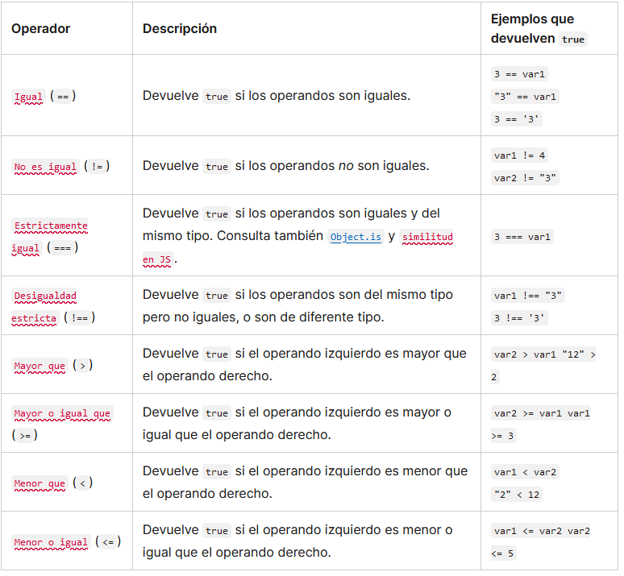

En JavaScript, el uso del punto y coma (;) es una práctica recomendada. El lenguaje tiene un mecanismo llamado "inserción automática de punto y coma" (automatic semicolon insertion - ASI) que intenta agregar punto y comas automáticamente en ciertos puntos del código donde están ausentes.

Esto significa que, en algunos casos, JavaScript intentará "corregir" la falta de punto y coma insertándolo automáticamente. Sin embargo, la interpretación del ASI puede llevar a comportamientos inesperados y errores sutiles, especialmente cuando las reglas no son claras.

Por lo tanto, para evitar posibles problemas y garantizar la claridad del código, muchos desarrolladores prefieren agregar punto y coma de manera explícita en sus programas.

A pesar de que la inserción automática de punto y coma puede ayudar a mitigar errores de sintaxis, es una buena práctica agregar punto y coma manualmente para evitar ambigüedades y problemas de interpretación. Esto es especialmente importante en situaciones como cuando varias instrucciones están en la misma línea, al usar declaraciones de retorno de valor o al minimizar el código.

En proyectos colaborativos o de gran escala, la consistencia en el estilo de codificación y la claridad del código son cruciales, y el uso explícito de punto y coma contribuye a un código más legible y menos propenso a errores de interpretación por parte de los programadores y del propio mecanismo de ASI.

En esta aula:

    Utilizamos la consola para probar y depurar nuestro código, mostrando mensajes y valores durante la ejecución del programa.
    Aprendimos a utilizar estructuras condicionales (if/else) para generar lógicas que permiten al programa tomar decisiones basadas en condiciones específicas.
    Implementamos un bloque de código para mostrar un mensaje en caso de que el intento del usuario no coincida con el número secreto.
    Usamos Template Strings para concatenar el número secreto con el valor almacenado en una variable y mostrar un mensaje personalizado.

En la próxima lección:

    Aprenderemos cómo trabajar con estructuras de repetición.

